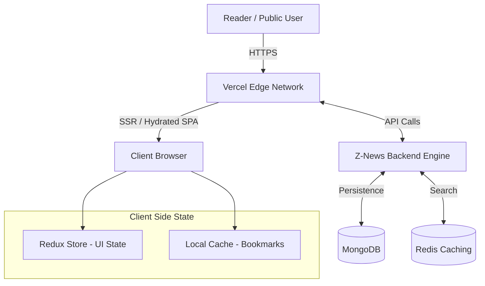
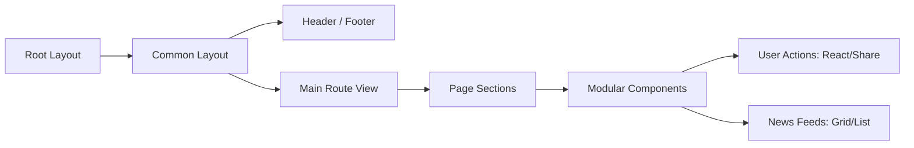
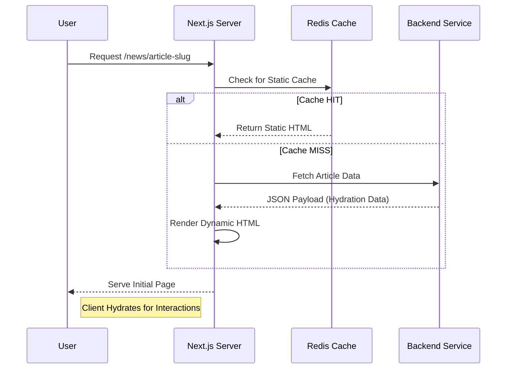

# Z-News Website Portal

A state-of-the-art, high-performance digital news delivery ecosystem engineered with Next.js 15, React 19, and Tailwind CSS 4. This platform is meticulously optimized for server-side rendering (SSR), dynamic article hydration, and real-time user engagement, serving as the primary public-facing interface for the Z-News network.

---

## Table of Contents

- [Core Modules and Features](#core-modules-and-features)
- [Tech Stack](#tech-stack)
- [Architecture](#architecture)
- [Project Directory Map](#project-directory-map)
- [Page Routing Matrix](#page-routing-matrix)
- [Engagement and Analytics](#engagement-and-analytics)
- [Data Orchestration](#data-orchestration)
- [Workflow Diagrams](#workflow-diagrams)
- [Development and Deployment](#development-and-deployment)

---

## Core Modules and Features

### Editorial Consumption Layer

The primary interface for news propagation, designed for readability and speed.

- **Dynamic Article Rendering**: Highly optimized news detail pages featuring rich HTML content, embedded media, and categorized metadata.
- **Breaking News Engine**: Real-time marquee integration for high-priority news flashes.
- **Segmented Home Architecture**: Orchestrated sections for Headlines, Featured Articles, and Chronological news feeds.
- **Hierarchical Navigation**: Category-based and event-based filtering allowing users to explore content through deep taxonomy trees.

### Engagement Ecosystem

A suite of interactive features designed to foster reader participation.

- **Multi-Status Reactions**: Atomic like/dislike system with real-time feedback.
- **Hybrid Commenting**: Sophisticated comment engine supporting both registered users and guest contributors with moderation queues.
- **Content Preservation**: Integrated bookmarking capabilities for saving articles for later consumption.
- **Sharing and Distribution**: Native social share integrations and high-fidelity print optimization for physical archiving.

### Infrastructure and Optimization

Enterprise-grade performance and discoverability features.

- **Next-Gen Typography**: Implementation of Noto Serif Bengali for superior readability across all device types.
- **SEO Orchestration**: Automatic metadata generation, open-graph protocols, and structured data for maximal search engine visibility.
- **Intelligent Media Delivery**: Lazy-loading carousel systems and responsive image optimization via Next.js Image components.
- **Real-time Synchronization**: Live view counts and engagement updates via optimized API polling and state hydration.

---

## Tech Stack

| Category             | Technology                                        |
| :------------------- | :------------------------------------------------ |
| Metadata Layer       | Next.js 15 (App Router - SSR/ISR)                 |
| Render Engine        | React 19 (Modern Concurrent Architecture)         |
| Programming Language | TypeScript (Strict Configuration)                 |
| Design Framework     | Tailwind CSS 4 (Utility-first with JIT)           |
| State Management     | Redux Toolkit & React Redux                       |
| Icons and Assets     | Lucide React & Custom SVG Primitives              |
| Motion & Animation   | Embla Carousel & React Fast Marquee               |
| Communication        | Axios (Typed API Abstraction)                     |
| Persistence          | Cookies-next & Local Storage                      |

---

## Architecture

### High-Level System Architecture

<div align="center">



</div>

### Frontend Component Hierarchy

<div align="center">



</div>

---

## Project Directory Map

```text
src/
├── app/             # Application Router (Next.js 15 Structure)
│   ├── (common)/   # Shared layouts for public-facing pages
│   │   ├── (home)/ # Dashboard / Home view
│   │   ├── news/   # Detailed article routing
│   │   ├── search/ # Query-based discovery
│   │   └── ...     # Category, Event, and Static pages
│   └── layout.tsx  # Global providers and font bootstrapping
├── components/      # UI Composition Layer
│   ├── (common)/   # Page-specific feature components
│   ├── cards/      # Reusable news and media cards
│   ├── partials/   # Layout elements (Navbar, Footer, Sidebar)
│   ├── ui/         # Atomic UI primitives (Buttons, Inputs)
│   └── skeletons/  # Loading state management
├── services/        # Backend Communication Layer (Auth, News, Reaction)
├── redux/           # Global Client-side State Orchestration
├── providers/       # Context and Redux Wrappers
├── hooks/           # Domain-specific observer and UI hooks
├── config/          # SEO, Endpoints, and Environment constants
└── utils/           # Typed helpers and formatting utilities
```

---

## Page Routing Matrix

The system maps routes to specialized components to ensure optimal performance and SEO:

- **Home**: `/` - Aggregated view of headlines, breaking news, and featured content.
- **Article Detail**: `/news/[slug]` - Deep hydration of single articles with engagement controls.
- **Category Browsing**: `/category/[slug]` - Filtered feeds based on hierarchical taxonomy.
- **Event Feeds**: `/event/[slug]` - Specialized time-sensitive content discovery.
- **Global Search**: `/search` - Multi-parameter query interface for the editorial database.
- **Legacy/Slug Handling**: `/[slug]` - Dynamic resolution for about, contact, and custom pages.

---

## Engagement and Analytics

Standardized interaction patterns are maintained across the platform:

- **Vocal Engagement**: Standardized comment fields with strict length validation and spam protection.
- **Reaction Matrix**: Binary sentiment tracking (Like/Dislike) synchronized with the backend.
- **Traffic Telemetry**: Automated view incrementing on article entry to provide real-time popularity metrics.
- **Social Propagation**: High-performance sharing components using the web share API where available.

---

## Workflow Diagrams

### Article Loading and Hydration Workflow

<div align="center">



</div>

---

## Development and Deployment

### Environment Setup

1.  **Dependencies**:
    ```bash
    pnpm install
    ```

2.  **Configuration**:
    Initialize the environment profile by populating the `.env.local` file:
    ```bash
    NEXT_PUBLIC_APP_URL=http://localhost:3000
    NEXT_PUBLIC_API_URL=http://localhost:5000
    ```

3.  **Local Execution**:
    ```bash
    pnpm dev
    ```

### Production and Distribution

1.  **Optimization**:
    ```bash
    pnpm build
    ```

2.  **Static/Dynamic Hosting**:
    The project is pre-configured for Vercel deployment but compatible with any Node.js environment or static provider using the `output: standalone` configuration.

---

## License

Proprietary and Confidential. Unauthorized distribution or modification is strictly prohibited.

---

**Crafted with precision for the Z-News ecosystem.**
